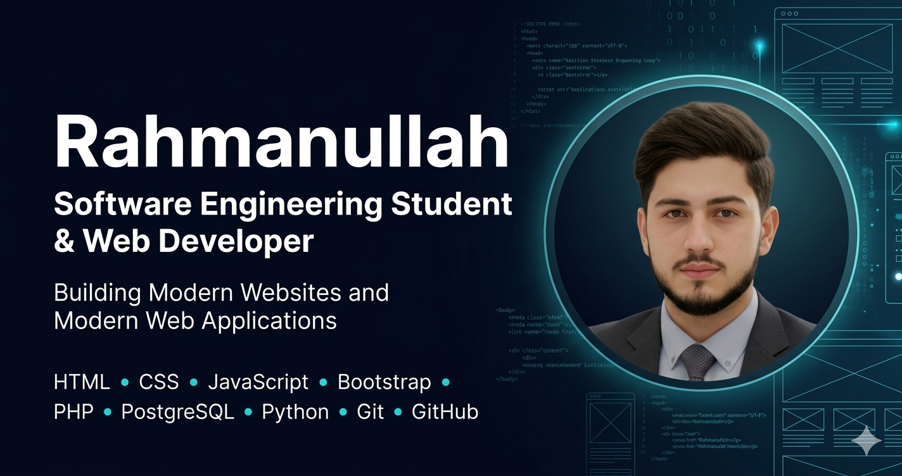

# CodeAlpha_task_p_portfolio
# 👨‍💻 Rahmanullah - Professional Portfolio

> A modern, responsive portfolio website showcasing my skills, projects, and services as a Software Engineering Student & Web Developer.

## 🌟 Live Demo

**View my portfolio:** [https://Rahmanullah-dev.github.io/p_portfolio/](https://Rahmanullah-dev.github.io/p_portfolio/)

## 📋 About This Project

This is my personal portfolio website where I showcase my work, skills, and services. It's designed to give visitors a clear understanding of who I am, what I can do, and how to contact me.

### ✨ Features

- 🎨 **Modern Design** - Clean, professional layout with smooth animations
- 🌓 **Dark/Light Mode** - Toggle between themes for comfortable viewing
- 📱 **Fully Responsive** - Looks great on all devices (mobile, tablet, desktop)
- ⌨️ **Typing Animation** - Dynamic role display on the hero section
- 🎯 **Professional Buttons** - Clear call-to-action buttons (Hire Me, View Projects, View CV, Download CV)
- 📊 **Skill Progress Bars** - Visual representation of my technical skills
- 🚀 **Project Gallery** - Showcasing my best work with tech stack tags
- 📍 **Contact Section** - Multiple ways to reach me (Email, WhatsApp, LinkedIn, GitHub)
- 🔗 **Social Links** - Professional social media integration with hover effects

## 🛠️ Technologies Used

### Frontend
- **HTML5** - Semantic structure
- **CSS3** - Custom styling with CSS variables
- **JavaScript** - Interactive elements and animations

### Icons & Fonts
- **Font Awesome 6** - Professional icons
- **Google Fonts** - Inter & Poppins fonts

### Tools
- **Git & GitHub** - Version control and hosting
- **GitHub Pages** - Free web hosting

## 📁 Project Structure
p_portfolio/
│
├── index.html # Main HTML file
├── style.css # All styles and themes
├── main.js # JavaScript functionality
├── cv.html # Online CV page (if available)
│
├── images/
│ ├── profile.jpg # Profile picture
│ └── portfolio-preview.jpg # Social media preview image
│
├── cv/
│ └── Rahmanullah - CV.pdf # Downloadable CV
│
└── README.md # Project documentation

## 📞 Contact Me

- **Email:** amankhan039616@gmail.com
- **WhatsApp:** [+92 3061620033](https://wa.me/923061620033)
- **LinkedIn:** [Rahman Ullah](https://www.linkedin.com/in/rahman-ullah-474897392)
- **GitHub:** [@Rahmanullah-dev](https://github.com/Rahmanullah-dev)

---

**© 2026 Rahmanullah | Made with ❤️ for the web**
